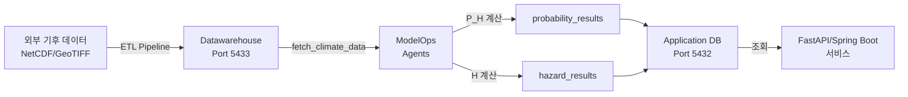

# SKALA Physical Risk AI - Backend AIops

> 물리적 리스크 확률 및 위험도 자동 계산 파이프라인

[](https://www.python.org/)
[](https://www.postgresql.org/)
[](LICENSE)

최종 수정일: 2025-11-25
버전: v1.0

---

## 📋 목차

- [개요](#개요)
- [프로젝트 구조](#프로젝트-구조)
- [주요 기능](#주요-기능)
- [시스템 아키텍처](#시스템-아키텍처)
- [빠른 시작](#빠른-시작)
- [ModelOps 파이프라인](#modelops-파이프라인)
- [ETL 파이프라인](#etl-파이프라인)
- [환경 설정](#환경-설정)
- [실행 방법](#실행-방법)
- [데이터베이스 스키마](#데이터베이스-스키마)
- [문서](#문서)

---

## 개요

SKALA Physical Risk AI Backend AIops는 **기후 변화 물리적 리스크 분석을 자동화**하는 배치 처리 시스템입니다.

### 핵심 목표

- 🎯 **위험 발생확률 P(H) 계산**: bin별 발생확률 및 AAL (연간 평균 손실률) 자동 산출
- 📊 **위험도 H 계산**: 9개 리스크별 Hazard Score 및 등급 자동 산출
- 🔄 **연간 자동 실행**: 매년 1월 1일 자동 배치 처리
- 💾 **결과 저장**: Application DB에 계산 결과 저장하여 FastAPI/Spring Boot 서비스 제공

### 지원 리스크 유형 (9개)

1. **극한 고온** (Extreme Heat)
2. **극한 한파** (Extreme Cold)
3. **가뭄** (Drought)
4. **하천 홍수** (River Flood)
5. **도시 홍수** (Urban Flood)
6. **해수면 상승** (Sea Level Rise)
7. **태풍** (Typhoon)
8. **산불** (Wildfire)
9. **수자원 스트레스** (Water Stress)

---

## 프로젝트 구조

이 저장소는 **두 개의 독립적인 파이프라인**으로 구성됩니다:

```
backend_aiops/
│
├── ETL/                          # 데이터 로딩 파이프라인 (일회성)
│   ├── scripts/                  # 기후 데이터 로딩 스크립트
│   │   ├── load_admin_regions.py
│   │   ├── load_monthly_grid_data.py
│   │   ├── load_yearly_grid_data.py
│   │   └── ...
│   ├── pyproject.toml
│   ├── README.md
│   └── USAGE.md
│
├── modelops/                     # AI 배치 처리 파이프라인 (연간 자동)
│   ├── agents/                   # 리스크 계산 에이전트
│   │   ├── probability_calculate/  # P(H) 계산 (9개 에이전트)
│   │   │   ├── base_probability_agent.py
│   │   │   ├── extreme_heat_probability_agent.py
│   │   │   └── ...
│   │   └── hazard_calculate/       # H 계산 (9개 에이전트)
│   │       ├── base_hazard_hscore_agent.py
│   │       └── ...
│   │
│   ├── batch/                    # 배치 프로세서
│   │   ├── probability_batch.py      # P(H) 배치 처리
│   │   ├── probability_scheduler.py  # P(H) 스케줄러
│   │   ├── hazard_batch.py          # H 배치 처리
│   │   └── hazard_scheduler.py      # H 스케줄러
│   │
│   ├── database/                 # DB 연결
│   │   └── connection.py
│   │
│   ├── config/                   # 설정
│   │   └── settings.py
│   │
│   └── triggers/                 # DB NOTIFY 리스너
│       └── notify_listener.py
│
├── Physical_RISK_calculate/      # 물리적 리스크 계산 로직 (참고용)
│
├── docs/                         # 문서
│   ├── ERD_Diagram.md
│   ├── DEPLOYMENT_GUIDE.md
│   ├── GITHUB_SECRETS.md
│   └── LOCAL_CICD_TEST.md
│
├── main.py                       # ModelOps 진입점
├── pyproject.toml                # ModelOps 의존성
├── Dockerfile                    # 배포용 컨테이너
└── README.md                     # 본 문서
```

---

## 주요 기능

### 1. **위험 발생확률 P(H) 자동 계산**

#### 계산 방식
- **강도지표 X(t)**: 연도별/월별 리스크 강도 계산
- **bin 분류**: 강도에 따른 구간 분류
- **발생확률 P[i]**: KDE 기반 연속적 확률 분포 추정
- **AAL 계산**: `AAL = Σ(P[i] × DR[i])`

#### 결과 저장
```sql
probability_results (
    latitude, longitude, risk_type,
    probability,  -- AAL (연간 평균 손실률)
    bin_data      -- bin별 확률/손상률 (JSONB)
)
```

#### bin_data 구조
```json
[
  {"bin": 1, "range": "0~3", "probability": 0.8000, "base_damage_rate": 0.0010},
  {"bin": 2, "range": "3~8", "probability": 0.1200, "base_damage_rate": 0.0030},
  ...
]
```

### 2. **위험도 H 자동 계산**

#### 계산 방식
- **기후 데이터 조회**: Datawarehouse에서 격자별 기후 시계열 조회
- **Hazard Score 산출**: 리스크별 특화된 알고리즘 적용
- **등급 분류**: MINIMAL, LOW, MEDIUM, HIGH, CRITICAL

#### 결과 저장
```sql
hazard_results (
    latitude, longitude, risk_type,
    hazard_score,       -- 원본 점수
    hazard_score_100,   -- 0-100 정규화 점수
    hazard_level        -- 등급
)
```

### 3. **자동 스케줄링**

#### 스케줄 설정
```python
# settings.py
probability_schedule: 매년 1월 1일 02:00
hazard_schedule: 매년 1월 1일 04:00
```

#### 실행 흐름
```
매년 1월 1일 02:00
  ↓
[ProbabilityScheduler 실행]
  ↓
전체 격자 (451,351개) 조회
  ↓
9개 리스크 × 전체 격자 병렬 계산
  ↓
AAL + bin_data → probability_results 테이블
  ↓
2시간 후 (04:00)
  ↓
[HazardScheduler 실행]
  ↓
Hazard Score 계산 및 저장
  ↓
완료 (약 5시간 소요)
```

### 4. **DB NOTIFY 트리거 지원**

수동 실행 필요 시:

```sql
-- PostgreSQL에서 트리거
NOTIFY probability;  -- P(H) 배치 즉시 실행
NOTIFY hazard;       -- H 배치 즉시 실행
```

### 5. **병렬 처리**

```python
# settings.py
parallel_workers: 4  # 동시 처리 워커 수
```

- ProcessPoolExecutor 기반 병렬 처리
- 격자별 독립 계산으로 성능 최적화

---

## 시스템 아키텍처

### 데이터베이스 구조

```
┌─────────────────────────────────────────────────────┐
│              SKALA Physical Risk AI                 │
├──────────────────────┬──────────────────────────────┤
│  Application DB      │       Datawarehouse          │
│  (PostgreSQL 16)     │       (PostGIS 16-3.4)       │
│  포트: 5432          │       포트: 5433              │
├──────────────────────┼──────────────────────────────┤
│                      │                              │
│ • users              │ • location_admin (5,259)     │
│ • sites              │ • location_grid (451,351)    │
│ • analysis_jobs      │ • ta_data (433M rows)        │
│ • physical_risk_     │ • rn_data (433M rows)        │
│   scores             │ • wsdi_data (36M rows)       │
│                      │ • csdi_data (36M rows)       │
│ • probability_       │ • ... (14개 기후 테이블)      │
│   results ✨         │                              │
│ • hazard_results ✨  │ • raw_dem (래스터)           │
│                      │ • raw_landcover (래스터)     │
│                      │ • API 캐시 (11개 테이블)      │
└──────────────────────┴──────────────────────────────┘
```

### 파이프라인 흐름



---

## 빠른 시작

### 사전 요구사항

- Python 3.11+
- PostgreSQL 16 (Application DB - 포트 5432)
- PostgreSQL 16 + PostGIS 3.4 (Datawarehouse - 포트 5433)
- 8GB+ RAM
- 100GB+ 디스크 공간

### 설치

```bash
# 1. 저장소 클론
git clone <repository-url>
cd backend_aiops

# 2. 가상환경 생성 및 의존성 설치
uv sync

# 또는 pip 사용
python -m venv .venv
source .venv/bin/activate  # Windows: .venv\Scripts\activate
pip install -e .
```

### 환경 설정

```bash
# .env 파일 생성
cat > .env << EOF
# Application Database
DATABASE_HOST=localhost
DATABASE_PORT=5432
DATABASE_NAME=skala_application
DATABASE_USER=skala_app_user
DATABASE_PASSWORD=your_password

# Datawarehouse
DW_HOST=localhost
DW_PORT=5433
DW_NAME=skala_datawarehouse
DW_USER=skala_dw_user
DW_PASSWORD=your_password

# Scheduler Settings
PROBABILITY_SCHEDULE_MONTH=1
PROBABILITY_SCHEDULE_DAY=1
PROBABILITY_SCHEDULE_HOUR=2
PROBABILITY_SCHEDULE_MINUTE=0

HAZARD_SCHEDULE_MONTH=1
HAZARD_SCHEDULE_DAY=1
HAZARD_SCHEDULE_HOUR=4
HAZARD_SCHEDULE_MINUTE=0

# Performance
PARALLEL_WORKERS=4
EOF
```

### 실행 순서

#### 1단계: ETL 실행 (최초 1회 필수!)

```bash
cd ETL

# 샘플 테스트 (2-3분)
export SAMPLE_LIMIT=10
./test_sample_load.sh

# 전체 데이터 로드 (12-15시간)
unset SAMPLE_LIMIT
python scripts/load_admin_regions.py
python scripts/load_monthly_grid_data.py
python scripts/load_yearly_grid_data.py
python scripts/load_sea_level_netcdf.py
```

#### 2단계: ModelOps 실행

```bash
cd ..

# 스케줄러 시작 (백그라운드 실행)
python main.py
```

출력 예시:
```
Starting AIops workflow system
Schedulers started
  - Probability: 1/1 02:00
  - Hazard: 1/1 04:00
Listening for NOTIFY events...
```

---

## ModelOps 파이프라인

### 1. **Probability 계산 파이프라인**

#### 실행 스케줄
- **자동**: 매년 1월 1일 02:00
- **수동**: `NOTIFY probability;`

#### 처리 흐름

```python
# probability_batch.py
전체 격자 조회 (451,351개)
  ↓
격자별 병렬 처리 (4 workers)
  ↓
각 격자당:
  1. 기후 데이터 조회 (Datawarehouse)
  2. 9개 리스크 에이전트 실행
     - 강도지표 X(t) 계산
     - bin 분류 및 발생확률 P[i] 계산
     - AAL = Σ(P[i] × DR[i])
  3. 결과 저장 (Application DB)
  ↓
완료 (약 2-3시간)
```

#### 에이전트 목록

| 에이전트 | 강도지표 | bin 기준 | 시간 단위 |
|---------|---------|---------|----------|
| `ExtremeHeatProbabilityAgent` | WSDI | 분위수 기반 (Q80, Q90, Q95, Q99) | Yearly |
| `ExtremeColdProbabilityAgent` | CSDI | 분위수 기반 | Yearly |
| `DroughtProbabilityAgent` | SPEI-12 | 가뭄 등급 (-2, -1.5, -1, -0.5) | Monthly |
| `RiverFloodProbabilityAgent` | RX5DAY | 강수량 기준 (100, 150, 200, 300mm) | Yearly |
| `UrbanFloodProbabilityAgent` | RX1DAY | 강수량 기준 (50, 80, 120, 200mm) | Yearly |
| `SeaLevelRiseProbabilityAgent` | 해수면 상승(cm) | 상승 높이 (20, 40, 60, 100cm) | Yearly |
| `TyphoonProbabilityAgent` | 풍속(m/s) | 등급 기준 (17, 25, 33, 44 m/s) | Event-based |
| `WildfireProbabilityAgent` | FWI | 위험도 (low, moderate, high, extreme) | Monthly |
| `WaterStressProbabilityAgent` | 수자원 비율 | 스트레스 수준 (0.8, 0.6, 0.4, 0.2) | Yearly |

#### 결과 데이터

```json
{
  "risk_type": "extreme_heat",
  "aal": 0.0025,
  "bin_data": [
    {"bin": 1, "range": "0~3", "probability": 0.8000, "base_damage_rate": 0.0010},
    {"bin": 2, "range": "3~8", "probability": 0.1200, "base_damage_rate": 0.0030},
    {"bin": 3, "range": "8~20", "probability": 0.0500, "base_damage_rate": 0.0100},
    {"bin": 4, "range": "20~40", "probability": 0.0250, "base_damage_rate": 0.0200},
    {"bin": 5, "range": "40~inf", "probability": 0.0050, "base_damage_rate": 0.0350}
  ]
}
```

### 2. **Hazard Score 계산 파이프라인**

#### 실행 스케줄
- **자동**: 매년 1월 1일 04:00 (Probability 2시간 후)
- **수동**: `NOTIFY hazard;`

#### 처리 흐름

```python
# hazard_batch.py
전체 격자 조회 (451,351개)
  ↓
격자별 병렬 처리 (4 workers)
  ↓
각 격자당:
  1. 기후 데이터 조회 (Datawarehouse)
  2. 9개 리스크 에이전트 실행
     - 리스크별 특화 점수 계산
     - 0-100 정규화
     - 등급 분류 (MINIMAL~CRITICAL)
  3. 결과 저장 (Application DB)
  ↓
완료 (약 2-3시간)
```

#### 결과 데이터

```json
{
  "risk_type": "extreme_heat",
  "hazard_score": 75.5,
  "hazard_score_100": 75.5,
  "hazard_level": "HIGH"
}
```

---

## ETL 파이프라인

### 역할

**Datawarehouse에 기후 데이터를 로드하는 일회성 작업**

- 외부 NetCDF, Shapefile, GeoTIFF → PostgreSQL
- ModelOps의 **전제조건** (데이터가 없으면 작동 불가)

### 주요 스크립트

| 스크립트 | 입력 | 출력 테이블 | 시간 | 행 수 |
|---------|------|-----------|------|------|
| `load_admin_regions.py` | Shapefile | `location_admin` | 2분 | 5,259 |
| `load_monthly_grid_data.py` | NetCDF | `ta_data`, `rn_data` 등 | 3시간 | 433M/테이블 |
| `load_yearly_grid_data.py` | NetCDF | `wsdi_data`, `csdi_data` 등 | 2시간 | 36M/테이블 |
| `load_sea_level_netcdf.py` | NetCDF | `sea_level_data` | 5분 | 6,880 |
| `load_landcover.py` | GeoTIFF | `raw_landcover` (래스터) | 3시간 | ~500 GB |

### 실행

```bash
cd ETL
uv sync
python scripts/load_admin_regions.py
python scripts/load_monthly_grid_data.py
# ... (자세한 내용은 ETL/README.md 참조)
```

**상세 문서**: [ETL/README.md](ETL/README.md), [ETL/USAGE.md](ETL/USAGE.md)

---

## 환경 설정

### 필수 환경 변수

**중요**: 이 프로젝트는 **`.env` 파일에서만** 환경변수를 로드합니다. 시스템 환경변수를 사용하지 마세요.

`.env` 파일 생성:

```bash
# Data Warehouse Configuration (Primary DB for climate data)
DW_HOST=localhost
DW_PORT=5433
DW_NAME=skala_datawarehouse
DW_USER=skala_dw_user
DW_PASSWORD=1234

# Application Database Configuration (For Spring Boot - user/site data)
APP_HOST=localhost
APP_PORT=5432
APP_NAME=skala_application
APP_USER=skala_app_user
APP_PASSWORD=your_password

# Database Configuration (Legacy - for backward compatibility)
DATABASE_HOST=localhost
DATABASE_PORT=5433
DATABASE_NAME=skala_datawarehouse
DATABASE_USER=skala_dw_user
DATABASE_PASSWORD=1234

# Scheduler Configuration
PROBABILITY_SCHEDULE_MONTH=1
PROBABILITY_SCHEDULE_DAY=1
PROBABILITY_SCHEDULE_HOUR=2
PROBABILITY_SCHEDULE_MINUTE=0

HAZARD_SCHEDULE_MONTH=1
HAZARD_SCHEDULE_DAY=1
HAZARD_SCHEDULE_HOUR=4
HAZARD_SCHEDULE_MINUTE=0

# Batch Processing Configuration
PARALLEL_WORKERS=4
BATCH_SIZE=1000

# PostgreSQL LISTEN/NOTIFY
NOTIFY_CHANNEL=aiops_trigger
```

### 시스템 환경변수 제거 (선택사항)

시스템에 DB 관련 환경변수가 설정되어 있다면, 혼란을 방지하기 위해 제거하는 것을 권장합니다:

```powershell
# PowerShell 스크립트 실행
.\clear_system_env_vars.ps1
```

또는 수동으로 제거:
- Windows: 시스템 속성 → 환경변수 → 사용자/시스템 변수에서 `DW_*`, `APP_*`, `DATABASE_*` 제거
- Linux/Mac: `~/.bashrc` 또는 `~/.zshrc`에서 관련 export 구문 제거

---

## 실행 방법

### 1. **자동 스케줄러 실행 (프로덕션)**

```bash
# 백그라운드 실행
nohup python main.py > logs/modelops.log 2>&1 &

# 또는 systemd 서비스로 실행 (Linux)
sudo systemctl start aiops-modelops
```

### 2. **수동 배치 실행 (테스트)**

#### Probability 배치만 실행

```python
from modelops.batch.probability_batch import ProbabilityBatchProcessor
from modelops.database.connection import DatabaseConnection

processor = ProbabilityBatchProcessor({'parallel_workers': 4})
grid_coordinates = DatabaseConnection.fetch_grid_coordinates()
result = processor.process_all_grids(grid_coordinates)
print(result)
```

#### Hazard 배치만 실행

```python
from modelops.batch.hazard_batch import HazardBatchProcessor
from modelops.database.connection import DatabaseConnection

processor = HazardBatchProcessor({'parallel_workers': 4})
grid_coordinates = DatabaseConnection.fetch_grid_coordinates()
result = processor.process_all_grids(grid_coordinates)
print(result)
```

### 3. **DB NOTIFY 트리거**

```bash
# PostgreSQL에 접속
psql -h localhost -p 5432 -U skala_app_user -d skala_application

# NOTIFY 이벤트 발생
NOTIFY probability;  -- P(H) 배치 즉시 실행
NOTIFY hazard;       -- H 배치 즉시 실행
```

### 4. **Docker 실행**

```bash
# Docker 이미지 빌드
docker build -t skala-aiops-modelops .

# 실행
docker run -d \
  --name aiops-modelops \
  --env-file .env \
  skala-aiops-modelops
```

---

## 데이터베이스 스키마

### Application DB 테이블

#### probability_results

| 컬럼 | 타입 | 설명 |
|------|------|------|
| `latitude` | NUMERIC | 위도 (PK) |
| `longitude` | NUMERIC | 경도 (PK) |
| `risk_type` | VARCHAR | 리스크 타입 (PK) |
| `probability` | REAL | **AAL** = Σ(P[i] × DR[i]) |
| `bin_data` | JSONB | bin별 확률/손상률 배열 |
| `calculated_at` | TIMESTAMPTZ | 계산 시각 |

**probability 컬럼**: AAL (Annual Average Loss, 연간 평균 손실률)
- 공식: `AAL = Σ(P[i] × DR[i])`
- 범위: 0.0 ~ 1.0 (0% ~ 100%)
- 예시: 0.0025 = 0.25%

#### hazard_results

| 컬럼 | 타입 | 설명 |
|------|------|------|
| `latitude` | NUMERIC | 위도 (PK) |
| `longitude` | NUMERIC | 경도 (PK) |
| `risk_type` | VARCHAR | 리스크 타입 (PK) |
| `hazard_score` | REAL | 원본 위험도 점수 |
| `hazard_score_100` | REAL | 0-100 정규화 점수 |
| `hazard_level` | VARCHAR | 위험 등급 |
| `calculated_at` | TIMESTAMPTZ | 계산 시각 |

**hazard_level 등급**:
- `MINIMAL`: < 20
- `LOW`: 20-40
- `MEDIUM`: 40-60
- `HIGH`: 60-80
- `CRITICAL`: 80+

**상세 ERD**: [docs/ERD_Diagram.md](docs/ERD_Diagram.md)

---

## 모니터링 및 로깅

### 로그 확인

```bash
# 실시간 로그 모니터링
tail -f logs/modelops.log

# 에러 검색
grep -i "error\|failed" logs/modelops.log

# 완료 확인
grep -i "completed" logs/modelops.log
```

### 배치 진행 상황 확인

```sql
-- 계산된 격자 수 확인
SELECT
    risk_type,
    COUNT(*) AS calculated_grids,
    MAX(calculated_at) AS last_update
FROM probability_results
GROUP BY risk_type
ORDER BY risk_type;

-- Hazard Score 완료 상황
SELECT
    risk_type,
    COUNT(*) AS calculated_grids,
    AVG(hazard_score_100) AS avg_score,
    MAX(calculated_at) AS last_update
FROM hazard_results
GROUP BY risk_type
ORDER BY risk_type;
```

### 성능 모니터링

```bash
# 시스템 리소스
htop

# 데이터베이스 연결
docker exec skala_application psql -U skala_app_user -d skala_application -c "
SELECT count(*) FROM pg_stat_activity WHERE state = 'active'
"

# 데이터베이스 크기
docker exec skala_application psql -U skala_app_user -d skala_application -c "
SELECT pg_size_pretty(pg_database_size('skala_application'))
"
```

---

## 성능 최적화

### 병렬 워커 수 조정

```bash
# .env 파일에서
PARALLEL_WORKERS=8  # CPU 코어 수에 맞춰 조정
```

### 데이터베이스 튜닝

```sql
-- work_mem 증가
ALTER SYSTEM SET work_mem = '256MB';

-- maintenance_work_mem 증가
ALTER SYSTEM SET maintenance_work_mem = '1GB';

-- 재시작
SELECT pg_reload_conf();
```

### 배치 크기 조정

```python
# probability_batch.py 또는 hazard_batch.py
# ProcessPoolExecutor의 max_workers 조정
```

---

## 문제 해결

### 문제 1: 데이터베이스 연결 실패

```bash
# 증상
psycopg2.OperationalError: could not connect to server

# 해결
# 1. 데이터베이스 실행 확인
docker ps | grep skala

# 2. 연결 테스트
psql -h localhost -p 5432 -U skala_app_user -d skala_application
psql -h localhost -p 5433 -U skala_dw_user -d skala_datawarehouse

# 3. .env 파일 확인
cat .env
```

### 문제 2: ETL 데이터 없음

```bash
# 증상
ERROR: fetch_climate_data returned empty result

# 해결
# Datawarehouse에 데이터가 로드되었는지 확인
docker exec skala_datawarehouse psql -U skala_dw_user -d skala_datawarehouse -c "
SELECT COUNT(*) FROM wsdi_data;
"

# 데이터가 없으면 ETL 먼저 실행
cd ETL
python scripts/load_yearly_grid_data.py
```

### 문제 3: 메모리 부족

```bash
# 증상
MemoryError: Unable to allocate array

# 해결
# 1. 병렬 워커 수 줄이기
PARALLEL_WORKERS=2

# 2. Docker 메모리 증가
# Docker Desktop → Settings → Resources → Memory: 8GB+
```

### 문제 4: 스케줄러 작동 안 함

```python
# 로그 확인
tail -f logs/modelops.log

# 스케줄 확인
# main.py 실행 시 출력되는 스케줄 시간 확인
# Schedulers started
#   - Probability: 1/1 02:00
#   - Hazard: 1/1 04:00

# 수동 트리거로 테스트
# psql에서: NOTIFY probability;
```

---

## 배포

### Docker 배포

```bash
# 이미지 빌드
docker build -t skala-aiops-modelops:latest .

# 실행
docker run -d \
  --name aiops-modelops \
  --env-file .env \
  --restart unless-stopped \
  skala-aiops-modelops:latest

# 로그 확인
docker logs -f aiops-modelops
```

### Kubernetes 배포

```yaml
# deployment.yaml
apiVersion: apps/v1
kind: Deployment
metadata:
  name: aiops-modelops
spec:
  replicas: 1
  selector:
    matchLabels:
      app: aiops-modelops
  template:
    metadata:
      labels:
        app: aiops-modelops
    spec:
      containers:
      - name: modelops
        image: skala-aiops-modelops:latest
        envFrom:
        - secretRef:
            name: aiops-secrets
        resources:
          requests:
            memory: "4Gi"
            cpu: "2"
          limits:
            memory: "8Gi"
            cpu: "4"
```

**상세 배포 가이드**: [docs/DEPLOYMENT_GUIDE.md](docs/DEPLOYMENT_GUIDE.md)

---

## 개발

### 로컬 개발 환경

```bash
# 개발 의존성 설치
uv sync --dev

# 또는
pip install -e ".[dev]"

# 테스트 실행
pytest

# 코드 포맷팅
black .

# Linting
ruff check .

# 타입 체킹
mypy modelops
```

### 테스트

```bash
# 전체 테스트
pytest

# 커버리지 포함
pytest --cov=modelops --cov-report=html

# 특정 에이전트 테스트
pytest scratch/test_future_probability_agents.py
```

---

## 문서

### 주요 문서

- [ERD 다이어그램](docs/ERD_Diagram.md) - 데이터베이스 스키마
- [배포 가이드](docs/DEPLOYMENT_GUIDE.md) - Docker/Kubernetes 배포
- [GitHub Secrets](docs/GITHUB_SECRETS.md) - CI/CD 설정
- [로컬 CI/CD 테스트](docs/LOCAL_CICD_TEST.md) - GitHub Actions 로컬 테스트

### ETL 문서

- [ETL README](ETL/README.md) - ETL 개요
- [ETL USAGE](ETL/USAGE.md) - ETL 사용 가이드
- [ETL SETUP](ETL/SETUP.md) - ETL 설치 가이드

---

## API 엔드포인트 (참고용)

ModelOps 배치 결과는 FastAPI/Spring Boot 서비스에서 조회 가능:

```bash
# Probability 결과 조회
GET /api/v1/probability?lat=37.5&lon=127.0&risk_type=extreme_heat

# Hazard Score 조회
GET /api/v1/hazard?lat=37.5&lon=127.0&risk_type=extreme_heat
```

**응답 예시**:

```json
{
  "latitude": 37.5,
  "longitude": 127.0,
  "risk_type": "extreme_heat",
  "aal": 0.0025,
  "bin_data": [
    {"bin": 1, "range": "0~3", "probability": 0.8, "base_damage_rate": 0.001},
    ...
  ],
  "calculated_at": "2025-01-01T06:30:00Z"
}
```

---

## 기여

### 커밋 컨벤션

```bash
# 기능 추가
feat: Add new probability agent for landslide risk

# 버그 수정
fix: Correct AAL calculation in base agent

# 문서
docs: Update README with deployment instructions

# 리팩토링
refactor: Simplify bin classification logic
```

### 브랜치 전략

```bash
main              # 프로덕션
develop           # 개발
feature/*         # 기능 개발
hotfix/*          # 긴급 수정
```

---

## 라이선스

이 프로젝트는 MIT 라이선스 하에 배포됩니다.

---

## 지원

질문이나 문제가 있는 경우:
- 이슈 등록: [GitHub Issues](https://github.com/On-Do-Polaris/backend_aiops/issues)
- SKALA Physical Risk AI 팀 문의

---

## 팀

**SKALA Physical Risk AI Team**

- 데이터 엔지니어링: ETL 파이프라인 개발
- ML 엔지니어링: ModelOps 에이전트 개발
- DevOps: 배포 및 인프라 관리

---

**최종 수정**: 2025-11-25
**버전**: v1.0
**문서 작성**: SKALA Physical Risk AI Team
