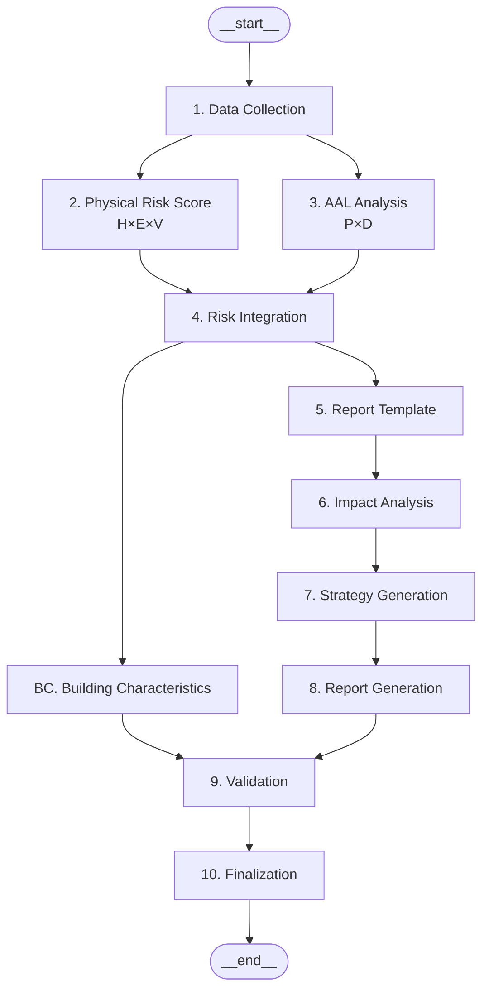

# Physical Risk Calculator - Claude Fast Pickup 문서

**작성일**: 2025-12-02
**버전**: 1.0.0
**목적**: 새로운 대화 세션에서 바로 프로젝트 컨텍스트를 파악하고 작업을 시작할 수 있도록 핵심 정보 제공

---

## 🎯 프로젝트 개요

### 무엇을 하는 시스템인가?

**TCFD 준수 물리적 기후 리스크 평가 시스템**

- 입력: 한국 내 주소 또는 위경도 좌표
- 출력: 9개 물리적 리스크 점수 (4개 SSP 시나리오별)
- 방법론: **Risk = H × E × V**
  - H (Hazard): 기후 재난 강도
  - E (Exposure): 자산 노출도
  - V (Vulnerability): 건물 취약성

### 9개 물리적 리스크

**TCFD 급성 리스크 (Acute Risks)**:
1. 태풍 (Typhoon)
2. 하천 홍수 (River Flood)
3. 도시 홍수 (Urban Flood)
4. 산불 (Wildfire)

**TCFD 만성 리스크 (Chronic Risks)**:
5. 극심한 고온 (Extreme Heat)
6. 극심한 한파 (Extreme Cold)
7. 가뭄 (Drought)
8. 물부족 (Water Stress)
9. 해수면 상승 (Sea Level Rise)

### 4개 SSP 시나리오

- **SSP126**: 저탄소 시나리오 (2°C 목표)
- **SSP245**: 중간 시나리오 (현재 추세, **기본값**)
- **SSP370**: 고탄소 시나리오
- **SSP585**: 최악 시나리오 (4-5°C 상승)

---

## 📁 코드 구조

### 핵심 모듈 (7개)

```
Physical_RISK_calculate/code/
├── risk_calculator.py           # 메인 오케스트레이터 (H×E×V 계산)
├── hazard_calculator.py         # H (Hazard) 계산
├── exposure_calculator.py       # E (Exposure) 계산
├── vulnerability_calculator.py  # V (Vulnerability) 계산
├── climate_data_loader.py       # KMA SSP NetCDF 로드
├── spatial_data_loader.py       # GeoTIFF, Shapefile 로드
└── building_data_fetcher.py     # 건축물대장 API 호출
```

### 지원 모듈 (5개)

```
├── disaster_api_fetcher.py      # 재난안전 API (하천, 침수 이력)
├── stream_order_simple.py       # DEM 고도, 하천 차수 계산
├── wamis_fetcher.py             # K-Water 댐 정보
├── fwi_calculator.py            # 산불위험지수 계산
└── fallback_constants.py        # Fallback 기본값
```

---

## 🔑 사용 방법

### 기본 사용

```python
from code.risk_calculator import RiskCalculator

# 1. 주소로 계산
calculator = RiskCalculator(target_year=2030)
result = calculator.calculate_all_risks("대전광역시 유성구 엑스포로 325")

# 2. 좌표로 계산
result = calculator.calculate_all_risks((36.383, 127.395))

# 3. 특정 시나리오만 계산
calculator = RiskCalculator(
    scenarios=['SSP245', 'SSP585'],
    target_year=2050
)
result = calculator.calculate_all_risks("서울특별시 강남구 테헤란로 152")
```

### 결과 구조

```json
{
  "scenarios": {
    "SSP126": {
      "risks": {
        "extreme_heat": {
          "score": 45.67,
          "severity": "MODERATE",
          "components": {
            "hazard": 65.2,
            "exposure": 70.0,
            "vulnerability": 80.0
          }
        },
        // ... 8개 리스크
      },
      "total_score": 456.78,
      "risk_level": "HIGH"
    },
    "SSP245": { /* ... */ },
    "SSP370": { /* ... */ },
    "SSP585": { /* ... */ }
  },
  "exposure": { /* E 데이터 (시나리오 공통) */ },
  "vulnerability": { /* V 데이터 (시나리오 공통) */ },
  "metadata": {
    "location": {
      "address": "대전광역시 유성구 엑스포로 325",
      "lat": 36.383,
      "lon": 127.395
    },
    "target_year": 2030,
    "scenarios": ["SSP126", "SSP245", "SSP370", "SSP585"]
  }
}
```

---

## 📊 데이터 소스

### 실제 데이터 (93% 사용률)

#### 1. KMA SSP 시나리오 (NetCDF) ✅
- **경로**: `Physical_RISK_calculate/data/climate/*.nc.gz`
- **형식**: NetCDF (gzip 압축)
- **해상도**: 1km 격자
- **기간**: 2021-2100년 (연 단위)
- **시나리오**: SSP126, SSP245, SSP370, SSP585
- **변수**: TXx, SU25, TR25, TNn, FD0, RN, CDD, RX1DAY 등 15개

#### 2. 토지피복도 (GeoTIFF) ✅
- **경로**: `Physical_RISK_calculate/data/landcover/ME_GROUNDCOVERAGE_50000/*.tif`
- **형식**: GeoTIFF
- **출처**: 환경부 중분류 (1:50,000)
- **용도**: 토지 유형, 불투수면 비율, 도시 열섬 효과

#### 3. NDVI (MODIS HDF) ✅
- **경로**: `Physical_RISK_calculate/data/drought/MOD13Q1*.hdf`
- **형식**: HDF
- **출처**: NASA MODIS MOD13Q1
- **해상도**: 250m, 16일 주기
- **용도**: 식생 밀도, 산불 연료량 추정

#### 4. DEM 고도 (ERDAS IMAGINE) ✅
- **경로**: `Physical_RISK_calculate/data/DEM/*.img`
- **형식**: .img, .txt
- **출처**: 국토지리정보원 5m 수치표고모델
- **용도**: 고도, 하천 차수, 유역 면적

#### 5. 행정구역 (Shapefile) ✅
- **경로**: `Physical_RISK_calculate/data/geodata/N3A_G0110000.shp`
- **형식**: Shapefile
- **출처**: 통계청 통계지리정보서비스

### API 데이터

#### 1. V-World 주소 변환 API ✅ (필수)
- **용도**: 주소 → 위경도 변환
- **API 키**: `VWORLD_API_KEY`
- **구현**: `exposure_calculator.py > _address_to_coords()`

#### 2. 건축물대장 API ✅ (필수)
- **용도**: 건물 층수, 용도, 구조, 건축연도
- **API 키**: `BUILDING_API_KEY`
- **구현**: `building_data_fetcher.py`

#### 3. 재난안전 API ✅ (선택)
- **용도**: 하천 정보, 침수 이력
- **API 키**: `RIVER_API_KEY`, `EMERGENCYMESSAGE_API_KEY`
- **구현**: `disaster_api_fetcher.py`

### 미구현/통계 사용 (7%)

#### 1. SMAP 토양수분 ⚠️
- **문제**: MODIS Sinusoidal 좌표 변환 미구현
- **Fallback**: `soil_moisture = 0.2` (정상 범위)

#### 2. 태풍 Best Track 🔴
- **문제**: API 미연동
- **Fallback**: 통계 기반 추정 (연 2.5회, 최대 풍속 150km/h)

#### 3. 수도 사용량 🔴
- **문제**: API 미연동
- **Fallback**: 인구 기반 추정 (1인당 200L/일)

---

## 🏗️ 워크플로우 아키텍처

### 전체 시스템 (LangGraph 기반)



### Physical Risk Score 모듈 위치

현재 작업 중인 **Physical Risk Calculator**는 **2번 단계 (Physical Risk Score)**에 해당합니다.

**입력**:
- 주소 또는 좌표
- SSP 시나리오
- 분석 연도

**출력**:
- 9개 리스크별 점수 (H×E×V)
- TCFD 분류 (Acute/Chronic)
- 메타데이터

**Downstream 에이전트**:
- **Risk Integration (3번)**: 점수 통합
- **Impact Analysis (6번)**: 영향 분석
- **Strategy Generation (7번)**: 대응 전략 수립

---

## 🔧 환경 설정

### 필수 API 키 (.env)

```bash
# 필수
VWORLD_API_KEY=your_vworld_api_key
BUILDING_API_KEY=your_building_api_key

# 선택
RIVER_API_KEY=your_river_api_key
EMERGENCYMESSAGE_API_KEY=your_emergency_api_key
```

### Python 의존성

```bash
pip install netCDF4 rasterio geopandas numpy pandas requests python-dotenv h5py
```

---

## 📝 주요 설계 원칙

### 1. TCFD 준수
- TCFD Final Report 2017 권고안 준수
- 급성/만성 리스크 분류
- 시나리오 기반 분석 (SSP)
- 정량적 재무 영향 평가 가능

### 2. 실제 데이터 우선
- 하드코딩 금지
- KMA 공식 기후 시나리오 사용
- Open API 적극 활용
- Fallback은 최후 수단

### 3. Fallback 정책
- API 실패 시에만 작동
- 통계 기반 보수적 추정
- `data_source: 'fallback'` 명시

### 4. 과학적 근거
- IPCC AR6 기준 준수
- WMO ETCCDI 극한기후 지수 사용
- 참고문헌 명시

---

## 🚨 알려진 제약사항

### 1. 데이터 시간 해상도
- **KMA SSP는 연 단위만 제공** (2021, 2022, ..., 2100)
- 분기별/월별 데이터 불가능
- 시간 지평 분석: 프론트엔드에서 연별 데이터 활용

### 2. 좌표 변환 문제
- SMAP 토양수분: MODIS Sinusoidal 좌표 변환 미구현
- 현재 -9999 반환 → Fallback 0.2 사용

### 3. API 제한
- 태풍 Best Track: API 미연동 (통계 사용)
- 수도 사용량: API 미연동 (인구 추정)

### 4. 지역 제한
- **한국 내 주소만 지원**
- 해외 좌표 입력 시 Fallback 값 반환

---

## 💡 빠른 디버깅 가이드

### 문제 1: "NetCDF 파일을 찾을 수 없습니다"
**원인**: 기후 데이터 파일 누락
**해결**:
```bash
# 파일 확인
ls Physical_RISK_calculate/data/climate/

# 압축 해제 (필요시)
gunzip Physical_RISK_calculate/data/climate/*.nc.gz
```

### 문제 2: "API 키가 유효하지 않습니다"
**원인**: .env 파일 누락 또는 잘못된 키
**해결**:
```bash
# .env 파일 확인
cat Physical_RISK_calculate/.env

# API 키 재발급
# VWORLD: https://www.vworld.kr/
# 건축물대장: https://www.data.go.kr/
```

### 문제 3: "주소를 찾을 수 없습니다"
**원인**: 도로명 주소 형식 오류
**해결**:
```python
# ❌ 잘못된 형식
"대전 유성구 엑스포로 325"  # 시도명 불완전

# ✅ 올바른 형식
"대전광역시 유성구 엑스포로 325"  # 시도명 전체
```

### 문제 4: "좌표가 범위를 벗어났습니다"
**원인**: 한반도 범위 밖 좌표
**해결**:
```python
# 한국 범위: 33°N-39°N, 124°E-132°E
lat, lon = 36.383, 127.395  # ✅ 대전
lat, lon = 37.5665, 126.9780  # ✅ 서울
lat, lon = 51.5074, -0.1278  # ❌ 런던 (범위 밖)
```

---

## 📚 주요 문서 참조

### 시스템 이해
- [SYSTEM_ARCHITECTURE.md](./SYSTEM_ARCHITECTURE.md): 전체 아키텍처
- [CODE_MODULES.md](./CODE_MODULES.md): 모듈별 상세 설명
- [architecture_v3.md](./architecture_v3.md): LangGraph 워크플로우

### 방법론
- [hazard_calculation_logic.md](../02_methodology/hazard_calculation_logic.md): H 계산 로직
- [risk_comparison_methodology.md](../02_methodology/risk_comparison_methodology.md): 리스크 비교 방법론

### 데이터
- [DATA_SOURCES.md](./DATA_SOURCES.md): 데이터 소스 목록
- [API_IMPLEMENTATION_STATUS.md](./API_IMPLEMENTATION_STATUS.md): API 구현 현황

### 개별 리스크
- [extreme_heat.md](../04_risk_analysis/hazard_types/extreme_heat.md): 극심한 고온
- [extreme_cold_risk.md](../04_risk_analysis/hazard_types/extreme_cold_risk.md): 극심한 한파
- [drought_risk.md](../04_risk_analysis/hazard_types/drought_risk.md): 가뭄
- [inland_flood_risk.md](../04_risk_analysis/hazard_types/inland_flood_risk.md): 하천 홍수
- [urban_flood_risk.md](../04_risk_analysis/hazard_types/urban_flood_risk.md): 도시 홍수
- [coastal_flood_risk.md](../04_risk_analysis/hazard_types/coastal_flood_risk.md): 해수면 상승
- [typhoon_risk.md](../04_risk_analysis/hazard_types/typhoon_risk.md): 태풍
- [wildfire_risk.md](../04_risk_analysis/hazard_types/wildfire_risk.md): 산불
- [water_stress_risk.md](../04_risk_analysis/hazard_types/water_stress_risk.md): 물부족

---

## 🎬 다음 작업 시작 시

### 새로운 대화에서 이 문서 활용법

1. **이 문서를 먼저 읽어달라고 요청**
   ```
   Physical_RISK_calculate/docs/01_project_overview/claude_FP.md 파일을 읽고 프로젝트를 파악해줘
   ```

2. **작업 컨텍스트와 함께 요청**
   ```
   claude_FP.md를 읽었으면, risk_calculator.py에 시간 지평 분석 기능을 추가해줘
   ```

3. **디버깅 시 빠른 참조**
   ```
   claude_FP.md의 디버깅 가이드를 참고해서 NetCDF 로드 오류를 해결해줘
   ```

### 자주 하는 작업

#### 1. 새로운 리스크 추가
- `hazard_calculator.py`에 `_calculate_XXX_hazard()` 메서드 추가
- `risk_calculator.py`의 `RISK_DISPLAY_NAMES`에 표시명 추가
- `docs/04_risk_analysis/hazard_types/XXX_risk.md` 문서 작성

#### 2. API 연동
- `XXX_api_fetcher.py` 파일 생성
- API 키를 `.env`에 추가
- Fallback 로직 구현
- `API_IMPLEMENTATION_STATUS.md` 업데이트

#### 3. 시나리오 추가
- `climate_data_loader.py`의 `SCENARIOS` 리스트에 추가
- NetCDF 파일 추가 (`data/climate/XXX_*.nc.gz`)
- `risk_calculator.py`의 `SCENARIO_NAMES`에 설명 추가

#### 4. 출력 포맷 변경
- `risk_calculator.py`의 `calculate_all_risks()` 반환값 수정
- Downstream 에이전트 영향도 확인 (Impact Analysis, Strategy Generation)

---

## 📞 문의 및 지원

### 코드 위치
```
Physical_RISK_calculate/
├── code/               # 소스 코드
├── data/               # 로컬 데이터 (NetCDF, GeoTIFF 등)
├── docs/               # 문서
└── tests/              # 테스트 코드
```

### Git 브랜치
- `main`: 메인 브랜치
- `cm`: 현재 작업 브랜치

### 버전 정보
- **현재 버전**: v2.0.0
- **마지막 업데이트**: 2024-11-24
- **Python**: 3.8+
- **주요 라이브러리**: netCDF4, rasterio, geopandas

---

**이 문서는 Claude가 프로젝트를 빠르게 이해하고 작업을 시작할 수 있도록 작성되었습니다.**
**새로운 대화에서 이 문서를 먼저 읽으면 이전 컨텍스트 없이도 바로 작업 가능합니다.**
